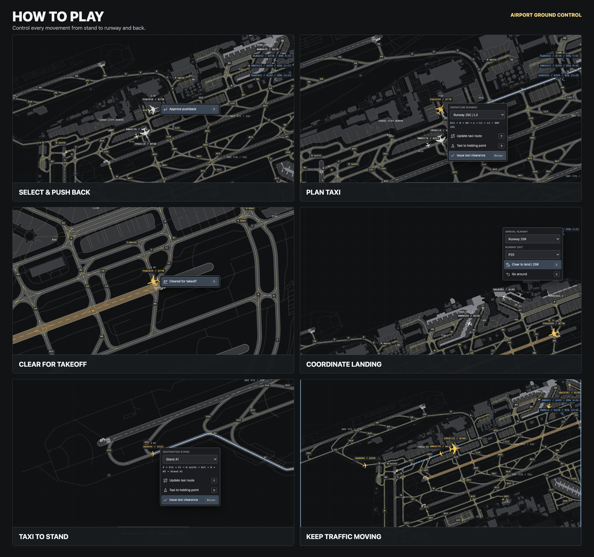

# Airport Ground Control Free

Ground Control is a browser-based airport surface-control game. Direct aircraft between stands, taxiways and runways while keeping traffic moving safely.

The airport maps use real-world geometry. Aircraft follow the mapped taxiway network, use compatible stands and behave differently according to their size and performance. The traffic, weather and operating scenarios are simulated.

## Objective

Manage aircraft from arrival to departure for as long as possible:

- Keep runways and taxiways moving efficiently.
- Prevent aircraft conflicts and blocked routes.
- Assign suitable runways, exits and stands.
- Respect aircraft size, braking performance and wake separation.
- Complete movements to increase your score.

There is no shift timer or final level. Traffic continues as long as you keep playing.

## Basic Controls

- **Click or right-click an aircraft** to open its available actions.
- **Drag the map** to pan and use the mouse wheel or pinch gesture to zoom.
- **Click taxiway points** while planning a route to add intermediate waypoints.
- Press **N** to jump to the next aircraft requesting attention.
- Press **Space** to pause or resume.
- Press **F** to fit the entire airport in view.
- Press **Esc** to close a menu or cancel an unfinished route.

Actions that are not currently safe or valid are unavailable. Successful clearances automatically close the aircraft menu.

## Departures

1. Select an aircraft at a stand and approve pushback.
2. Choose a pushback direction where multiple options are available.
3. Wait for pushback and tug disconnection to finish.
4. Open the aircraft again and choose **Plan taxi route**.
5. Select the departure runway and add any desired taxiway waypoints.
6. Issue the taxi clearance and monitor other ground traffic.
7. At the runway holding point, issue **Line up & wait** or a **Rolling departure**.
8. Clear the aircraft for takeoff when runway separation permits.

A rolling departure enters the runway and accelerates without stopping. It is available only when projected runway separation remains safe.

## Arrivals

Incoming aircraft appear at the edge of the map with an ETA. Once landing clearance is issued, a blue badge shows the runway you assigned, such as **RWY 25L**.

1. Select the incoming aircraft.
2. Choose an active arrival runway parallel to its approach.
3. Select a runway exit suitable for the aircraft's braking performance.
4. Issue landing clearance when the runway is available or projected to become clear in time.
5. After landing, wait for the aircraft to vacate the runway.
6. Assign a compatible free stand.
7. Plan and issue its taxi route to the stand.

Aircraft continue toward the runway even without clearance. If an aircraft reaches the decision point without landing clearance, it automatically goes around and costs points. A cleared aircraft also goes around if projected runway separation is lost.

After parking, an aircraft completes a realistically scaled turnaround. It can later request pushback and continue as a departure; new aircraft do not simply appear at empty stands during play.

## Runway Planning

Open the runway control in the top bar to choose an airport preset or configure individual runway ends.

Depending on airport capabilities, a runway end can be assigned to:

- Arrivals
- Departures
- Mixed use
- Closed

Aircraft already committed to an approach or runway route keep their assignment during a configuration change. New traffic follows the new runway plan.

## Taxi and Traffic Control

Aircraft move only along the airport's connected ground network. You can add taxiway points to create the route you want before issuing clearance.

Additional traffic instructions include:

- **Hold position** - brakes the aircraft to a stop.
- **Continue taxi** - releases a manual hold or clearance limit.
- **Taxi to holding point** - sends the aircraft to a named intermediate point.
- **Hold short of** - creates a temporary clearance limit along its current route.
- **Follow** - queues behind another aircraft using a shared route.
- **Give way** - waits for intersecting traffic to pass.
- **Cross runway** - clears a configured runway crossing when safe.

Aircraft automatically maintain basic spacing and yield to traffic from the right at ordinary intersections. Difficult head-on situations or incompatible routes still require controller action.

## Map Indicators

Aircraft colors show their current movement state:

- **White** - at a stand
- **Brown** - pushing back
- **Yellow** - taxiing or waiting on the ground
- **Blue** - approaching or landing
- **Green** - taking off

An aircraft that needs a controller action pulses gently. Labels show the callsign and aircraft type. Incoming aircraft show their ETA; after landing clearance, they also show the assigned-runway badge.

## Scoring

- A completed arrival or departure earns **100 points**.
- An unresolved ground conflict costs **20 points**.
- An automatic go-around caused by missing clearance costs **25 points**.
- Normal queue spacing, automatic yielding and instructed holds do not cost points.

The top bar displays completed movements, score and conflicts.

## Keyboard Shortcuts

| Action | Key |
| --- | --- |
| Approve pushback | **P** |
| Choose pushback direction | **R** |
| Plan taxi route | **T** |
| Issue taxi clearance | **Enter** |
| Hold or resume | **H** |
| Clear to land | **L** |
| Go around | **G** |
| Cross runway | **K** |
| Line up and wait | **U** |
| Rolling departure | **O** |
| Clear for takeoff | **D** |
| Taxi to holding point | **B** |
| Hold short | **S** |
| Follow aircraft | **Y** |
| Give way | **W** |
| Continue past holding limit | **C** |
| Cancel traffic instruction | **X** |
| Next request | **N** |
| Pause or resume | **Space** |
| Fit airport | **F** |
| Close menu or cancel route | **Esc** |

The keyboard button in the top bar opens this reference inside the game.

## Aircraft

The fleet includes:

- ATR 72-600
- Dash 8-400
- Embraer E190
- Airbus A220-300, A320, A321neo, A330-300 and A350-900
- Boeing 737-800, 777-300ER and 747-8

Aircraft differ in dimensions, acceleration, braking, cornering, wake category, turnaround duration and stand compatibility. Large aircraft need suitable gates and may require later runway exits.

## Saved Games

The game automatically saves progress in the current browser. Reloading restores aircraft positions, routes, clearances, runway configuration, score, map position, pause state and simulation speed.

The trash button in the top bar deletes the current airport's save and starts a new randomized game at **1x** speed.

Saves belong to the browser profile and page address where they were created. Clearing browser data or using private browsing may remove them. Game time does not advance while the page is closed.

Map data is provided by [OpenStreetMap contributors](https://www.openstreetmap.org/copyright) under the [Open Database License](https://opendatacommons.org/licenses/odbl/1-0/).
